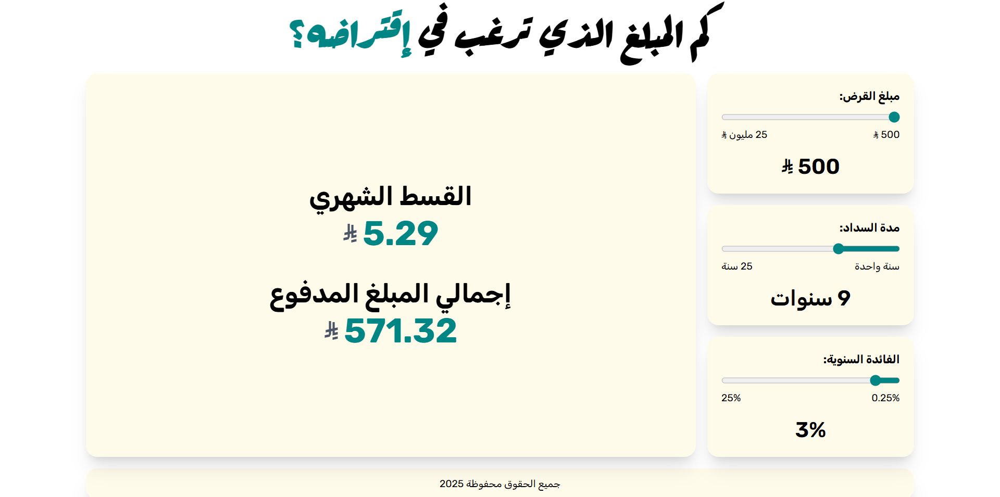

# Loan Calculator



A fully interactive **Loan Calculator** built with **React,TypeScript, Tailwind CSS, and framer motion**.
A modern UI Designed for **Arabic Users** with **RTL Layout** support.

## Live Demo

You can use the loan calculator via the link: (hasbah)[https://hasbah.netlify.app]

## Features

- Calculate **monthly payments**, **total interest**, and **total loan amount**
- Fully **Arabic UI** with **RTL layout**
- Smooth **animations**:
  - Form inputs sliding in one after another
  - Result card fade and slide animation
  - Animated letters for title
- Fully responsive design


## Tecnologies Used

- **React**
- **TypeScript**
- **Tailwind CSS**
- **Framer Motion**


## Use It Locally

1. Clone the repository:

```bash
git clone https://github.com/yourusername/loan-calculator.git
cd loan-calculator
```

2. Install dependencies:

```bash
npm install
```

3. Run the app:

```bash
npm start
```

The app will run at http://localhost:3000.


## Author

**Abdulrrahmann**
